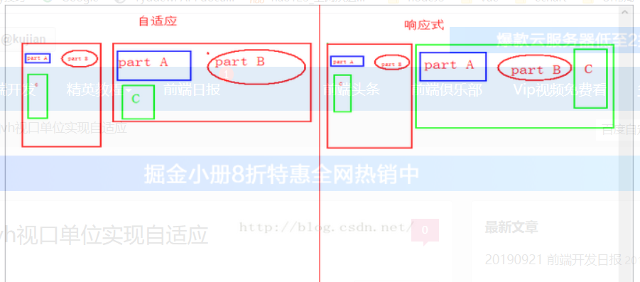
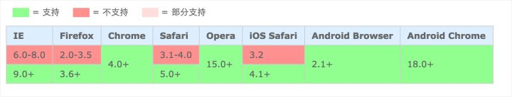
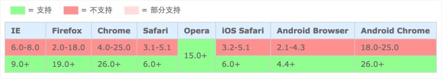
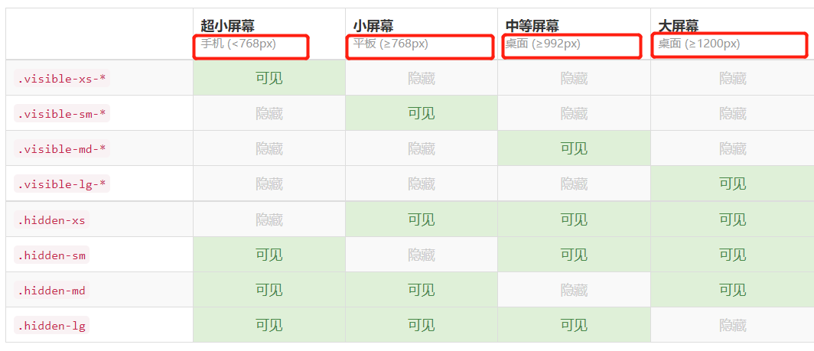

# 折叠屏适配解决方案
## 方案分类
    主要分为两类解决方案自适应和响应式
### 共同点
- 两者都是因为越来越多的 移动设备（ mobile, tablet device ）加入到互联网中来而出现的为移动设备提供更好的体验的技术。
- 用技术来使网页适应从小到大（现在到超大）的不同分辨率的屏幕.
- 都是为了解决同一张页面在不同设备分辨率上合理展示的技术。

### 不同点
- 响应式布局：针对不同的页面宽度，匹配不同的样式文件，展示不同的页面效果。根据页面宽度的连续变化，页面展示效果是非连续的。

- 自适应：针对不同的页面宽度，页面元素成比例的放大缩小，即在不同大小设备看起来一样。根据页面宽度的连续变化，页面展示效果是连续的。

 
## 自适应方案
通过相对长度单位（rem/em/vm/vh）来进行页面布局，使页面布局能够根据页面宽度实时变化。
### 优点：
- 使用一套代码，在不同大小屏幕上的显示效果是一样的
### 缺点
- 所有px需要转换为rem/vw，需要使用px2rem，px2vw之类的单位转换工具
- 普通手机的视觉效果需要重新审核

### rem 解决方案
    rem是相对于面根元素（html）的长度单位。

业界都基于`flexible.js`，监听页面的`resize`事件，动态设置html元素的 `font-size`，来达到页面元素自适应的目的
#### 原理
```js
const doc = window.document // 文档对象
const docEl = doc.documentElement // 文档对象元素

// 根据视窗宽度，设置根字体大小
const refreshRem = () => {
    const rem = docEl.getBoundingClientRect().width / 10
    docEl.style.fontSize = rem + 'px'
}

refreshRem() // 首次加载设置根字体模块

// 监听resize事件，设置根字体大小
window.addEventListener('resize', () => {
    refreshRem()
})
```
#### 浏览器兼容性
 

#### 演示地址
[rem 布局示例](http://huodong.m.taobao.com/act/yibo.html)


### viewport（vw）方案
    vw : 1vw 等于视口宽度的1%
    vh : 1vh 等于视口高度的1%

flexible.js给开发者的tips

    由于viewport单位得到众多浏览器的兼容，lib-flexible这个过渡方案已经可以放弃使用，不管是现在的版本还是以前的版本，都存有一定的问题。建议大家开始使用viewport来替代此方案。

#### 使用
使用Sass函数编译,将设计稿的尺寸（px）转换为vw单位
```css
$vm_base: 375; 
@function vw($px) {
    @return ($px / 375) * 100vw;
}
.mod_nav {
    background-color: #fff;
    &_list {
        display: flex;
        padding: vm(15) vm(10) vm(10); // 内间距
        &_item {
            flex: 1;
            text-align: center;
            font-size: vm(10); // 字体大小
            &_logo {
                display: block;
                margin: 0 auto;
                width: vm(40); // 宽度
                height: vm(40); // 高度
                img {
                    display: block;
                    margin: 0 auto;
                    max-width: 100%;
                }
            }
            &_name {
                margin-top: vm(2);
            }
        }
    }
}
```

#### 浏览器兼容性
在移动端 ios 8 以上以及 Android 4.4 以上获得支持，并且在微信 x5 内核中也得到完美的全面支持。


#### 演示地址
[vw 布局示例](https://jdc.jd.com/demo/ting/vw_layout.html?utm_source=caibaojian.com)

### rem vm 对比
|方案名称|易用性|浏览器兼容性|
|--|--|--|--|
|rem|需要使用flexible.js|好|
|vw|直接使用|较好|
  

## 响应式方案 
通过css媒体查询(@media)，针对不同的页面宽度，匹配不同的样式，达到适配不同屏幕的效果。
### 优点
- 针对折叠屏的宽度进行优化，不会影响到普通手机的代码展示

### 缺点
- 对于每一个需要适配的折叠屏的模组，都要添加css适配代码
- 随页面大小变化，展示效果是非连续的，也可能是不一致的
  
### 通过媒体查询的解决方案(参考bootstrap);

    

针对折叠屏加上适配折叠屏宽度的样式，使用示例：
### 
```css
@media screen and (min-width: 600px){
        .masthead h1 {
        font-size: 90px;
    }
}
```
## 名词解释
Peter-Paul Koch (江湖人称“PPK大神”)

## 参考
1. [淘宝手机WEB商场](https://h5.m.taobao.com/?sprefer=sypc00#index)
2. [使用Flexible实现手淘H5页面的终端适配](https://github.com/amfe/article/issues/17)
3. [flexible.js 演示](http://huodong.m.taobao.com/act/yibo.html)
4. [纯CSS3使用vw和vh视口单位实现自适应](http://caibaojian.com/vw-vh.html)
5. [vw 布局示例](https://jdc.jd.com/demo/ting/vw_layout.html?utm_source=caibaojian.com)