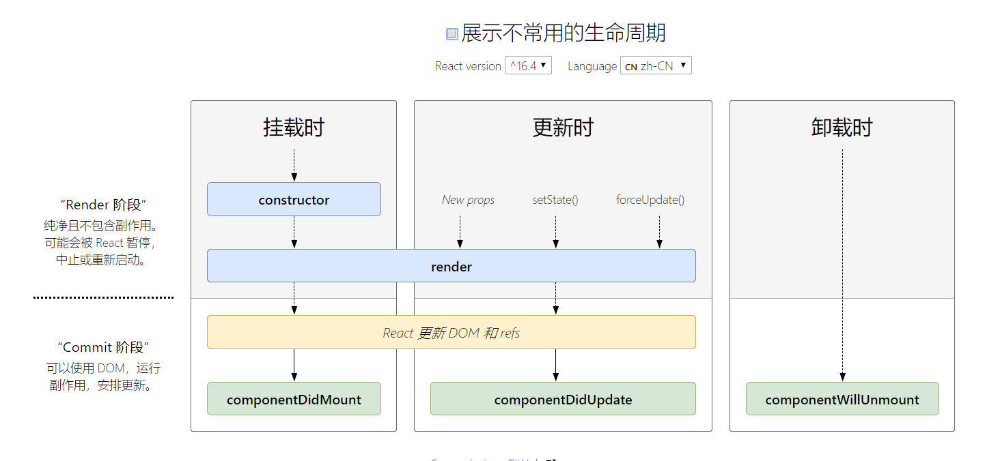

# react 快速入门心得
## 常用工具
- create-react-app react开发脚手架工具
- redux 基于flux的一个全局状态管理工具
    - 需要安装 redux redux-react
    - 提供的常用组件 
      - Provider 全局包裹器 
      - Reducer 处理器
      - Connecter 连接器
- react-router-dom react路由管理工具
    - 有三种路由模式
      - browserRouter 后台控制路由（/router1/router11）
      - hashRouter  前端控制路由（#/router1/router11）
      - memoryRouter 
    - 常用组件
      - Router 路由包裹器
      - Route  路由页面
      - Link   跳转连接

## jsx中写HTML的注意点
1. 标签中的 `class` 属性->`className`
2. `label`标签中的`for`属性-> `forHtml` （ `class`，`for` 均为js中的保留关键字）
3. 绑定事件要处理this的指向问题 
   ```html
    <input onClick={this.fn.bind(this)} />
   ```
4. jsx 语法要求html标签都必须闭合，且要注意HTML中为换行和空格问题，最好用"()"将HTML包起来 
## 一些概念
- 函数组件和class组件
- 受控表单和非受控表单
- jsx
## 生命周期
完整版

常用版

   
## 优点
1. 天然的基于class的组件化开发
2. jsx语法可以在js中使用html，绑定变量，使用函数会更加的自由，没有vue中很多预定义指令，如v-for，v-if，v-bind等；在react中这些功能都通过js实现

## 缺点
1. 对比vue，感觉router 和 redux确实没有vue-router和vuex好用！

## 术语
CDN 代表内容分发网络（Content Delivery Network）。CDN 会通过一个遍布全球的服务器网络来分发缓存的静态内容。
ES6, ES2015, ES2016 等
这些首字母缩写都是指 ECMAScript 语言规范标准的最新版本，JavaScript 语言是此标准的一个实现。其中 ES6 版本（也称为 ES2015）包括对前面版本的许多补充，例如：箭头函数、class、模板字面量、let 和 const 语句。可以在这里了解此规范特定版本的详细信息。


## 参考
[react 中文文档](https://zh-hans.reactjs.org/docs/getting-started.html)
[react 生命周期](http://projects.wojtekmaj.pl/react-lifecycle-methods-diagram/)