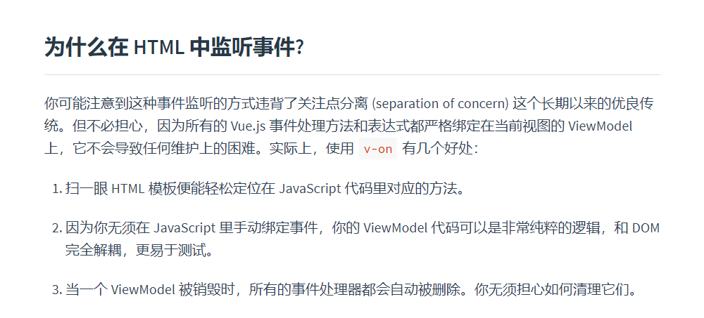

# Vue 中是否有必要使用事件委托
## 事件委托有两个主要优点：
1. 少添加事件监听可以方便的删除事件监听，释放内存。
但是释放事件监听的事情[Vue已经为你做好了](https://cn.vuejs.org/v2/guide/events.html)。
   
   
1. 减少dom对象和事件函数的链接,减少内存占用,提升性能。
由于v-vor循环中的每个单击侦听器都将使用相同的回调，因此除非你有成百上千的行或者确实遇到性能瓶颈，可以考虑不使用事件委托。

## 结论
最后，你可以通过向父元素@click侦听器来轻松实现事件委托。但是随后，你必须使用event.target 来判断点击的目标子元素。因此，只有在你真正发现性能问题而没有使用事件委托的情况下，才使用它。

```bash
# vue官方文档原文
你可能注意到这种事件监听的方式违背了关注点分离 (separation of concern) 这个长期以来的优良传统。但不必担心，因为所有的 Vue.js 事件处理方法和表达式都严格绑定在当前视图的 ViewModel 上，它不会导致任何维护上的困难。实际上，使用 v-on 有几个好处：

1. 扫一眼 HTML 模板便能轻松定位在 JavaScript 代码里对应的方法。

2. 因为你无须在 JavaScript 里手动绑定事件，你的 ViewModel 代码可以是非常纯粹的逻辑，和 DOM 完全解耦，更易于测试。

3. 当一个 ViewModel 被销毁时，所有的事件处理器都会自动被删除。你无须担心如何清理它们。
```
# 参考
1. [Vue列表 — 事件委托](https://segmentfault.com/a/1190000011698763)