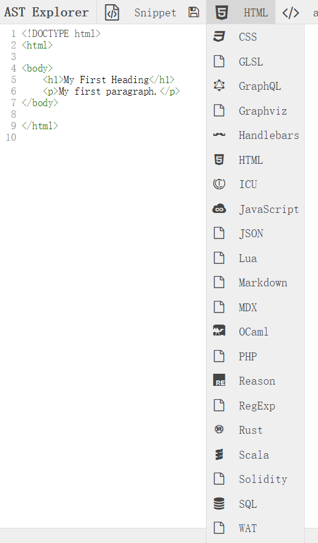

# 抽象语法树
最近领导要搞一个html和css自动生成工具，听到这个消息一脸懵逼，这是个啥？

最近查了查资料，涉及到语言编译，这个问题直接涉及到抽象语法树(AST)。先在这里简单做一点资料整理吧！

vczh 说计算机领域有三座大山，他们分别是图形学、编译原理、操作系统。AST属于编译原理。

项目启动起来，再给大家分享一下开发经验。

对于普通程序员，我认为编译原理这门课主要掌握几点就够用了：1. 词法分析方面，掌握正则表达式，了解dfa/nfa。2. Parsing 方面，能读懂BNF，知道AST，会写简单的递归下降parser，会用antlr之类的parser generator。3. 优化方面，知道现代编译器的优化能力有多强，知道如何配合编译器写出高效易读的代码，避免试图outsmart编译器。4. 会实现简单的虚拟机（stack-based，不带GC），并把四则运算表达式翻译为虚拟机指令。

# test
[AST Explore](https://astexplorer.net/#/2AmVrGuGVJ)  是一个很好的测试地址，提供前端能用到的所有语法的解析测试。

# reference
1. [csspaser](https://github.com/cwdoh/cssparser.js)
2. [csspaser 测试](http://cwdoh.com/cssparser.js/demo/CSS_stringify.html)
3. [htmlparser](https://github.com/tautologistics/node-htmlparser)
4. [AST Explore](https://astexplorer.net/#/2AmVrGuGVJ)