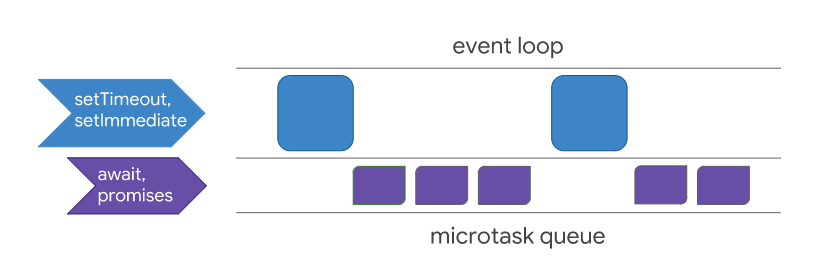

# 浏览器的Tasks、microtasks、 queues 和 schedules
    setTimeout、Promise、Async/Await 的区别


    一道面试题引发的血案，下面进入主题：
```js
// 今日头条面试题
async function async1() {
    console.log('async1 start')
    await async2()
    console.log('async1 end')
}
async function async2() {
    console.log('async2')
}
console.log('script start')
setTimeout(function () {
    console.log('settimeout')
})
async1()
new Promise(function (resolve) {
    console.log('promise1')
    resolve()
}).then(function () {
    console.log('promise2')
})
console.log('script end')
```
题目的本质，就是考察setTimeout、promise、async await的实现及执行顺序，以及JS的事件循环的相关问题。

答案：
```js
script start
async1 start
async2
promise1
script end
async1 end
promise2
settimeout
```
再看一个经典的例子：
```js
const p = Promise.resolve();
(async () => {
    await p;
    console.log('await end');
})();
p.then(() => {
    console.log('then 1');
}).then(() => {
    console.log('then 2');
});
```
答案：
```
then 1
then 2
await end
```
你答对了吗？这里涉及到Microtasks、Macrotasks、event loop 以及 JS 的异步运行机制。

一、event loop
JS主线程不断的循环往复的从任务队列中读取任务，执行任务，其中运行机制称为事件循环（event loop）。

二、Microtasks、Macrotasks（task）
在高层次上，JavaScript 中有 microtasks 和 macrotasks（task），它们是异步任务的一种类型，Microtasks的优先级要高于macrotasks，microtasks 用于处理 I/O 和计时器等事件，每次执行一个。microtask 为 async/await 和 Promise 实现延迟执行，并在每个 task 结束时执行。在每一个事件循环之前，microtask 队列总是被清空（执行）。

microtasks-vs-tasks

图1: 微任务和任务之间的区别

下面是它们所包含的api：

microtasks
- process.nextTick
- promise
- Object.observe (废弃)
- MutationObserver

macrotasks
- setTimeout
- setImmediate
- setInterval
- I/O
- UI 渲染
注意：

每一个 event loop 都有一个 microtask queue
每个 event loop 会有一个或多个macrotask queue ( 也可以称为task queue )
一个任务 task 可以放入 macrotask queue 也可以放入 microtask queue中
每一次event loop，会首先执行 microtask queue， 执行完成后，会提取 macrotask queue 的一个任务加入 microtask queue， 接着继续执行microtask queue，依次执行下去直至所有任务执行结束。
三、异步运行机制
我们已知， JS 是单线程的，至于为什么，详见 JS 基础之异步（一）。

下面看一个例子：
```js
// 1. 开始执行
console.log(1)	// 	2. 打印 1
setTimeout(function () {	// 6. 浏览器在 0ms 后，将该函数推入任务队列
    console.log(2)	// 7. 打印 2
    Promise.resolve(1).then(function () {	// 8. 将 resolve(1) 推入任务队列  9. 将 function函数推入任务队列
        console.log('ok')	// 10. 打印 ok
    })
})	// 3.调用 setTimeout 函数，并定义其完成后执行的回调函数
setTimeout(function (){		// 11. 浏览器 0ms 后，将该函数推入任务队列
    console.log(3)	// 12. 打印 3
})  // 4. 调用 setTimeout 函数，并定义其完成后执行的回调函数
// 5. 主线程执行栈清空，开始读取 任务队列 中的任务
// output： 1  2 ok 3
```
JS 主线程拥有一个 执行栈（同步任务） 和 一个 任务队列（microtasks queue），主线程会依次执行代码，

当遇到函数（同步）时，会先将函数入栈，函数运行结束后再将该函数出栈；
当遇到 task 任务（异步）时，这些 task 会返回一个值，让主线程不在此阻塞，使主线程继续执行下去，而真正的 task 任务将交给 浏览器内核 执行，浏览器内核执行结束后，会将该任务事先定义好的回调函数加入相应的**任务队列（microtasks queue/ macrotasks queue）**中。
当JS主线程清空执行栈之后，会按先入先出的顺序读取microtasks queue中的回调函数，并将该函数入栈，继续运行执行栈，直到清空执行栈，再去读取任务队列。
当microtasks queue中的任务执行完成后，会提取 macrotask queue 的一个任务加入 microtask queue， 接着继续执行microtask queue，依次执行下去直至所有任务执行结束。
这就是 JS的异步执行机制

四、async await、Promise、setTimeout
- setTimeout
```js
console.log('script start')	//1. 打印 script start
setTimeout(function(){
    console.log('settimeout')	// 4. 打印 settimeout
})	// 2. 调用 setTimeout 函数，并定义其完成后执行的回调函数
console.log('script end')	//3. 打印 script start
// 输出顺序：script start->script end->settimeout
```
- Promise

Promise本身是同步的立即执行函数， 当在 executor 中执行 resolve 或者 reject 的时候, 此时是异步操作， 会先执行 then/catch 等，当主栈完成后，才会去调用 resolve/reject 中存放的方法执行，打印 p 的时候，是打印的返回结果，一个 Promise 实例。
```js
console.log('script start')
let promise1 = new Promise(function (resolve) {
    console.log('promise1')
    resolve()
    console.log('promise1 end')
}).then(function () {
    console.log('promise2')
})
setTimeout(function(){
    console.log('settimeout')
})
console.log('script end')
// 输出顺序: script start->promise1->promise1 end->script end->promise2->settimeout
```
当JS主线程执行到Promise对象时，

promise1.then() 的回调就是一个 task
promise1 是 resolved 或 rejected ：那这个 task 就会放入当前事件循环回合的 microtask queue
promise1 是 pending：这个 task 就会放入 事件循环的未来的某个(可能下一个)回合的 microtask queue 中
setTimeout 的回调也是个 task ，它会被放入 macrotask queue 即使是 0ms 的情况
回到文章开头经典的例子：
```js
const p = Promise.resolve(); // 1. p 的状态为 resolve；
(async () => {  
    await p; // 2. 返回，并将 函数体后面的语句 console.log('await end') 放入下一个事件循环的 microtask queue 中
    console.log('await end'); // 6. 执行，打印 await end
})();
p.then(() => { // 3. p 的状态为 resolve,会把 p.then() 放入当前事件循环的 microtask queue中。
    console.log('then 1'); // 4. 执行，打印 then 1
}).then(() => {
    console.log('then 2'); // 5. 执行，打印 then 2，当前 microtask queue 结束，运行下一个 microtask queue
});
// 输出结果：then 1->then 1->await end
```
例如：
```js
console.log('script start');

setTimeout(function() {
  console.log('setTimeout');
}, 0);

Promise.resolve().then(function() {
  console.log('promise1');
}).then(function() {
  console.log('promise2');
});

console.log('script end');
// 输出结果：script start->script end->promise1->promise2->setTimeout
async await

async function async1(){
   console.log('async1 start');
    await async2();
    console.log('async1 end')
}
async function async2(){
    console.log('async2')
}

console.log('script start');
async1();
console.log('script end')

// 输出顺序：script start->async1 start->async2->script end->async1 end
```
async 函数返回一个 Promise 对象，当函数执行的时候，一旦遇到 await 就会先返回，等到触发的异步操作完成，再执行函数体内后面的语句。可以理解为，是让出了线程，跳出了 async 函数体。

举个例子：
```js
async function func1() {
    return 1
}

console.log(func1())
```
在这里插入图片描述
很显然，func1的运行结果其实就是一个 Promise 对象。因此我们也可以使用 then 来处理后续逻辑。
```js
func1().then(res => {
    console.log(res);  // 1
})
```
await 的含义为等待，也就是 async 函数需要等待 await 后的函数执行完成并且有了返回结果（ Promise 对象）之后，才能继续执行下面的代码。await通过返回一个Promise对象来实现同步的效果。

# reference
[浏览器的Tasks、microtasks、 queues 和 schedules](https://github.com/sisterAn/blog/issues/21)
[HTML系列：macrotask和microtask](https://zhuanlan.zhihu.com/p/24460769)