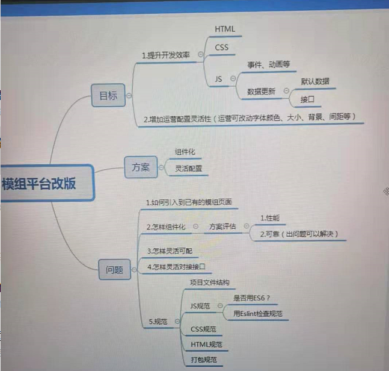
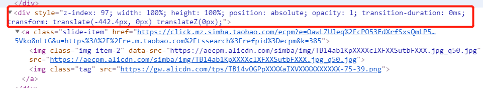

# 前端架构/前端工程化
> 前端架构与工程化，目标阿里，美团


## 模组后台架构
```
|---接口数据库服务
    |---后台控制端
        |---页面、模组管理
    |---前端展示端
        |---获取后端配置数据，展示页面
        |---客户端交互
        |---设计集成开发环境
```

## 思路
### 前后端分离
> 后端负责数据库通信，提供接口。
> 前端负责获取数据，页面展示。

#### 优点
1. 开发各有分工，分工使开发更加专业，专业产生效率；
2. 前端的开发安环境会更容易维护，配置和参数会更少；
3. 前端可以连接到专门的接口测试服务器，前端不用在本地部署接口服务了，接口服务也可以获取及时的更新；
4. 前端代码和后台框架解耦了，不需要使用.net或jsp来拼接页面了，前端会有更多的灵活性。
- js：eslint代码检查，babal代码转义，js模块化
- css：css预处理 sass，less，postcss
- 可以选择使用框架，与后台隔离。 

### 模块化/组件化
#### js/css 模块化
- js模块化 `es6 moudle` `require.js`
  >渐进式模块化方案 立即执行函数表达式（IIFE）immediately-invoked-function-expression，可以使尝试使用这种原生支持的模块化方案。
- css模块化 `BEM规范（弱规范）` `CSS Modules（强规范：类似于VUE）`  
#### 组件化框架
- react vue 等框架


### 编码规格
- 统一的代码格式化工具 （Beautify+EditorConfig）
- ESLint 代码检查
- [html 与css规范](https://codeguide.bootcss.com/)


###  一些完善模组开发管理系统的想法
1. 一期目标
- [ ] 将现有的`userControl` 独立出来
  - 关键结果 （OKR）
    -  [ ]  与现有的模组完成兼容，新开发模组可以加入到现有的`channel` 模板页中（channel模板页需要在生成页面时，注入该页面所包含的模组需要的模组数据）。
  
    -  [ ] 搭建一个模组前端开发平台，他包括了页面模板的获取（get），自动生成模组开发模板和目录结构（new），模组的后台注册（sign）和自动上传（upload）。

    -  [ ] `upload`前会生成生成最终插入channel页面的`css`和`js`文件,有一个publish文件夹，包括了`local`,`st`,`uat`,`prd（试运行）`;

    -  [ ] 能够开发一个类似于vue-template-loader的webpack-loader用于专门处理后台模组组件模板。（非关键目标）

1. 二期目标
   - 可以实现分行对模组的开发和注册，上传。

2. 三期目标
   - 完成整个系统服务的分层`API（service）`,`后台管理（model）`，`前台（usercontrol）`
 


### 代码测试
- 单元测试（mocha js断言库）
- 端到端测试



### 知乎问题
[淘宝手机WEB商场](https://h5.m.taobao.com/?sprefer=sypc00#index)是怎样搭建的？
1. 项目的整体架构
2. 使用的前/后端技术和框架
3. 如何满足业务多样化的需求
4. 如何实现页面的自适应？
5. 如下图所示，为什么css使用大量的`行内样式`，有什么好处，如何实现的？


## 参考
1. [大型项目前端架构浅谈（前阿里程序员）](https://zhuanlan.zhihu.com/p/67034025)
2. [谁能介绍下web前端工程化？(网易 · 前端工程师)](https://www.zhihu.com/question/24558375/answer/139920107)
3. [前端工程化开发方案app-proto(美团)](https://tech.meituan.com/2017/01/05/tech-salon-13-app-proto.html)
4. [美团外卖前端可视化界面组装平台 —— 乐高](https://zhuanlan.zhihu.com/p/27288444)
5. [ES6+ 开发环境搭建要点](http://eux.baidu.com/blog/fe/ES6+%E7%8E%AF%E5%A2%83%E6%90%AD%E5%BB%BA%E8%A6%81%E7%82%B9)
6. [Web Components](http://javascript.ruanyifeng.com/htmlapi/webcomponents.html)
7. [怎么判定 web 前端架构师的能力高低？](https://www.zhihu.com/question/26187669/answer/32470493)
8. [html 与css规范](https://codeguide.bootcss.com/)
9. [JavaScript编程规范](https://zhuanlan.zhihu.com/p/58408019)
10. [Vue.js 组件编码规范](https://zhuanlan.zhihu.com/p/25654116)
11. [JavaScript编码规范](https://github.com/ecomfe/spec/blob/master/javascript-style-guide.md#user-content-245-%E6%96%87%E4%BB%B6%E6%B3%A8%E9%87%8A)
12. [BEM —— 源自Yandex的CSS 命名方法论](https://segmentfault.com/a/1190000000391762)
13. [JavaScript：立即执行函数表达式（IIFE）](https://segmentfault.com/a/1190000003985390)


