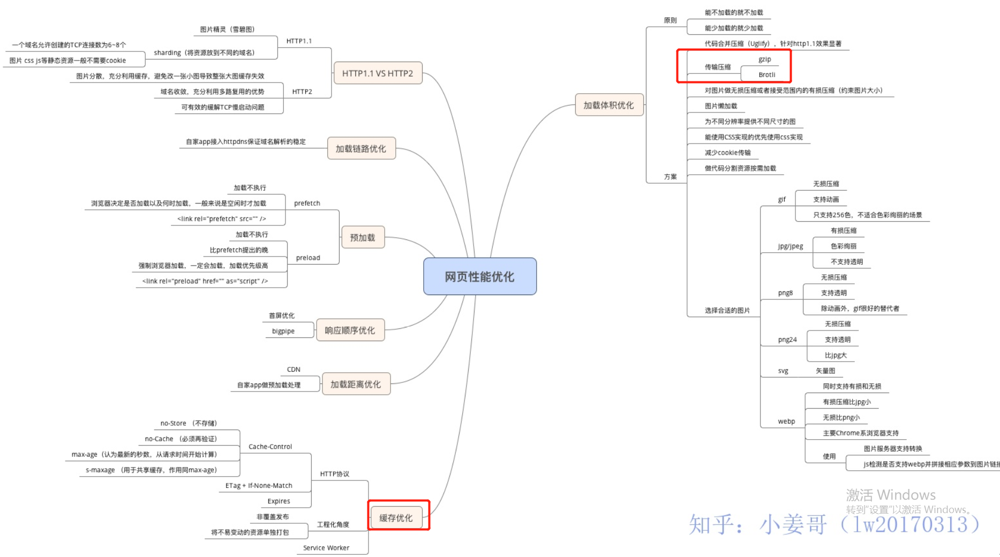

# 网页性能优化

非常全面的网站优化指南
[网站性能优化实战——从12.67s到1.06s的故事](https://juejin.im/post/5b6fa8c86fb9a0099910ac91)

1. 在做前端缓存时，尽可能设置长时间的强缓存，通过文件名加hash的方式来做版本更新。在代码分包的时候，应该将一些不常变的公共库独立打包出来，使其能够更持久的缓存。
2. 

## 图片懒加载
[VUE图片懒加载-vue lazyload插件的简单使用](https://www.cnblogs.com/xyyt/p/7650539.html)

### 前端工程化
如何搭建一个前端工程化的平台

### 前端工程化，静态化
1，生成静态文件，使用服务端缓存，代码压缩
2，前端，开发，测试，代码规范，代码编译
3， 前端性能优化，

# 参考
1. [网页性能优化](https://zhuanlan.zhihu.com/p/36030862)
2. [网页性能管理详解](http://www.ruanyifeng.com/blog/2015/09/web-page-performance-in-depth.html)
3. [最强前端性能优化，Google已经为你准备好了](https://zhuanlan.zhihu.com/p/67134654)
4. [前端骨架屏方案小结](https://segmentfault.com/a/1190000016689372)
5. [Vue页面骨架屏注入实践](https://segmentfault.com/a/1190000014832185)
6. [以用户为中心的性能指标(google)](https://developers.google.com/web/fundamentals/performance/user-centric-performance-metrics)
7. [延迟加载图像–完整指南](https://imagekit.io/blog/lazy-loading-images-complete-guide/)
8. [网站性能优化实战——从12.67s到1.06s的故事 :star:](https://juejin.im/post/5b6fa8c86fb9a0099910ac91)
9. [如何进行 web 性能监控](https://mp.weixin.qq.com/s/7ycHJtq81icA-BtY0WEzXw)

